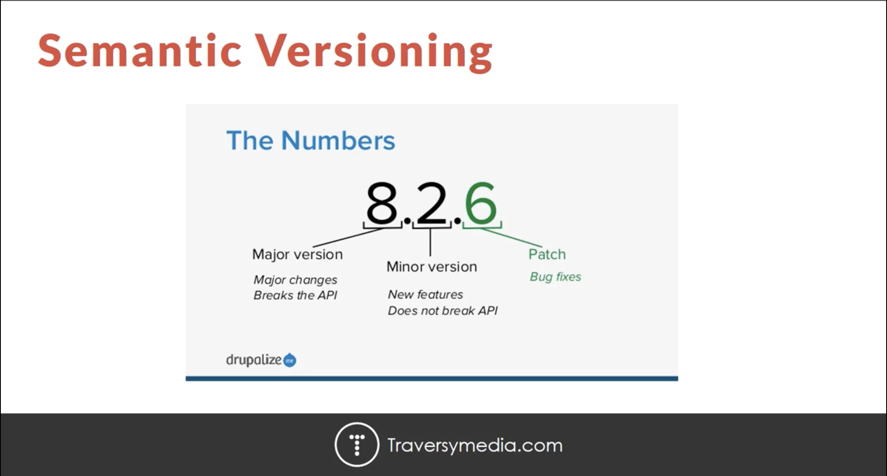

# NPM Crash Course
- [video](https://www.youtube.com/watch?v=jHDhaSSKmB0)

## what is NPM
- what NPM actually is so as I said it stands for **node package manager** and if you have any experience with Ruby on Rails it's similar to Ruby gems or if you're a Python developer it's similar to PIP.
- it's basically JavaScript package manager it's installed with nodejs but don't let that fool you into thinking that you need to have experience with the node.js runtime or node applications to be able to use NPM alright you could even use NPM just for you know to install bootstrap or foundation or some front-end framework so it's essentially just a JavaScript package manager all right no node.js skills are needed to use it
- now when I say packages or modules I mean the same thing they're used interchangeably and modules are basically just JavaScript libraries okay so you can install bootstrap as a package jQuery lodash just about every popular library or framework or script that's available is available with NPM 
- you're gonna learn how to install remove up date and list packages or modules will look in depth at the package.json file which is an extremely important file when it comes to using NPM and node applications we'll talk about local and global packages dependencies dev dependencies and the difference all the end not all but most all the important NPM commands and shortcuts will talk a little bit about versioning and also NPM scripts.

### you need those 
- [Nodejs](https://nodejs.org/en)
- [npm](https://www.npmjs.com/) -> the repository for NPM modules

1. GET VERSION
`npm -v (or --version)`

2. GET HELP
```
npm help
npm
```

3. CREATE PACKAGE.JSON
```
npm init
npm init -y (or --yes)
```

### the package.json file
- the package.json file is probably the most important file in the whole nodejs JavaScript world it's a manifest file that has all of your application info like its name its version author etc but that's not the most important part the most important thing is that it holds all of your applications dependencies and 
- what I mean by dependency ==is the modules that it needs to work== so if you are if your application runs on Express then you need to define in this file that it uses Express ok you'll want it in listed in the package jason so that if you deploy your app or if you move it somewhere it knows that it needs to use Express and not only does it list the name of the dependencies but also the specific versions that it uses ok because if it has the wrong version then things may break 
- ok you can also create scripts in your package JSON file called NPM scripts 
- now you could manually create this file but that would be kind of a waste of time because we have a very simple command called npm init which will actually create the file for us.
4. SET DEFAULTS
```
npm config set init-author-name "YOUR NAME"
npm set init-license "MIT"
```
5. GET DEFAULTS
```
npm config get init-author-name
npm get init-license
```
6. REMOVE DEFAULTS
```
npm config delete init-author-name
npm delete init-license
```
7. INSTALLING LOCAL PACKAGES
npm install lodash --save (or npm install --save lodash)
npm install moment --save
npm install gulp gulp-sass --save-dev

- install a module so the module I'm going to install is called **load** and I'm sure a lot of you know what that is it's basically ==a JavaScript library that gives you a bunch of utility functions that I can do things like sort arrays loop through arrays set timeouts and delays== just all different things to do with JavaScript and it makes it a lot easier than to just write it out with vanilla JavaScript so we're gonna install that so we're gonna go over here and say npm install lodash now there's one very important flag that we need here and that's - - save and what that does is it saves it to our package JSON as a dependency okay so that that's basically the most important part of this file and if we don't use - - save it will get installed .
- ==dev dependencies== and you want to solve something as a dev dependency if it's only gonna be used for development okay you're not going to need it in production and one one example that I can think of for this would be like gulp which is a task runner used to do things like minify your JavaScript compiled sass files things that you do in development .

`require('lodash')`
- whenever you module and you want to use it inside your application you just want to set a variable and set it to require. 

8. MOVE TO ANOTHER FOLDER
```
npm install
npm install --production
```

- what that does is it looks at the package.json dependencies and it installs anything that's inside of that.

9. REMOVING MODULES
```
npm uninstall gulp-sass --save-dev
npm remove gulp --save-dev
npm rm lodash --save
```
- so let's say that we don't want to use these this gulp SAS or gulp anymore so all we have to do is say NPM uninstall gulp our let's do let's do gulp SAS and since it's a dev dependency we also want to include that flag again all right because that's going to remove it from here as well as delete it so let's go ahead and run that all right so now you can see that that's gone it's also been deleted so there's also some aliases for uninstall so let's remove listen let's get rid of gulp now and we're gonna use removed ok so we can use uninstall or remove you can also use just RM or un tell any of those they're all going to do the same thing so let's say remove gulp and let's say - - save - dev and that removes gulp.

`npm install --production`
- npm install it's going to install all of our regular dependencies plus the dev dependencies okay so both of those but if we want to apply ==- - production== if we applied this flag what it's gonna do is it's only going to install the regular dependencies you can see added one package.

10. INSTALL CERTAIN VERSIONS
npm install lodash@4.17.3 --save

11. UPDATE

`npm update lodash --save`

- update to the latest version

> when we install a package or a module when we look inside the package Jason at the version numbers they're always in this this format so we have three three numbers separated by dots in between so basically each of these has a meaning so this last one here this is the patch version alright so what that means is that this is when when there's some kind of bug when there's something wrong and they fix it or a couple bugs and they fix them they're gonna increase this okay so this number gets increased now this isn't going to break anything on your on your in your application okay if you upgrade to the next patch version it's not going to break anything it's gonna fix you know fix some issues at least if the application is created by good developers all right so that's that's called the Hach version next we have the minor version okay which is the middle one so for the minor version they may add some new features okay so maybe there's some new features to the application but it's not gonna break your application okay your syntax should be safe okay so you should be you should be able to upgrade that version without having to have any worries now the major version which is this number this applies breaking changes okay so if you go if you have your application and you upgrade to let's say let's say from Express version 3 dot whatever to version 4 dot whatever your application is probably going to break and you're gonna have to go in you're gonna have to look at the new documentation and then upgrade your application you're gonna have to upgrade your syntax to match the new version so that's what these three numbers are. 

12. INSTALL GLOBAL MODULE
```
npm install -g nodemon
npm install -g live-server
# RUN NODEMON
nodemon
# RUN LIVE-SERVER
live-server
# REMOVE GLOBAL PACKAGES
npm remove -g nodemon
# INSTALL LIVE-SERVER LOCALLY
npm install live-server --save-dev

```
- example of a global module would be something like node Mon node Mon is a module that can continuously watch your applications so that you don't have to keep restarting it every time you edit it so every time you save it'll it'll it'll watch it it'll restart it and that's something that I like to install globally most of the time.

13. LISTING PACKAGES
```
npm list
npm list --depth 0
npm list --depth 1
```

- if you want to list the packages in your project you can use lists so if we say NPM list you'll see that we just have low - now I'm actually going to install gulp again just so I can show you something so when I say NPM install gulp and I'll just add it as a regular dependency okay so now if I say npm list you'll see that it's gonna list everything okay including all of the dependencies of gulp so let's say we just want to list the top-level what we can do is we can say npm list and we can add the depth flag so - - depth and we can set that to zero and then you can see it's only going to show us gulp and low - alright if we want to change the depth to one it'll show us just the dependencies of gulp okay but a lot of the dependencies of gulp have more dependencies and that can be another level so if we say - you'll see that it gets bigger so if you just do NPM list it'll show all of the dependencies of all the modules all.

14. NPM SCRIPT
```
"scripts": {
    "start": "node index.js",
    "dev": "live-server"
  },
```
```
# to run them 
- npm start
- npm run dev 
```
- if we look in our package dot jason we have a scripts object and by default they give you this test this is if you want to install something like mocha some kind of testing framework and you want to have you want to be able to say npm test now a lot of the times you'll see a start script so we're not going to use test I'm just gonna change it to start and then what you would do is put in the command to start your application which in our case is what node index J s so we would say node either index or index dot JSP and say npm start and that runs our application now there's a few reasons to do this one is because if someone takes your application they may not know or they may not want to look and see what your main file is they don't want to go in here and see all the main index J s because it could be something else it could be apt J s or server Js so NPM start gives them just an easy way to start it up without even have to look have to look another reason would be you might change this okay so you may change index J s like let's rename it to app dot J s and we'll go ahead and change the main here to app J s and then we can start this up with node app since we changed the name node index no longer works so what we would do is just update our start script like that not like that app is and then they can say NPM start and that works all right another reason is if you deploy to like let's say Heroku or something like that some kind of platform a lot of times they'll look at the start script to see what file is actually gonna need to need to be run so that's that's another reason but start isn't the I mean you can add any script you want like let's say we want instead of having to do live server globally let's say we want to install it locally and then create a script for it so what I'll do is I'll say NPM actually first of all I'm going 


