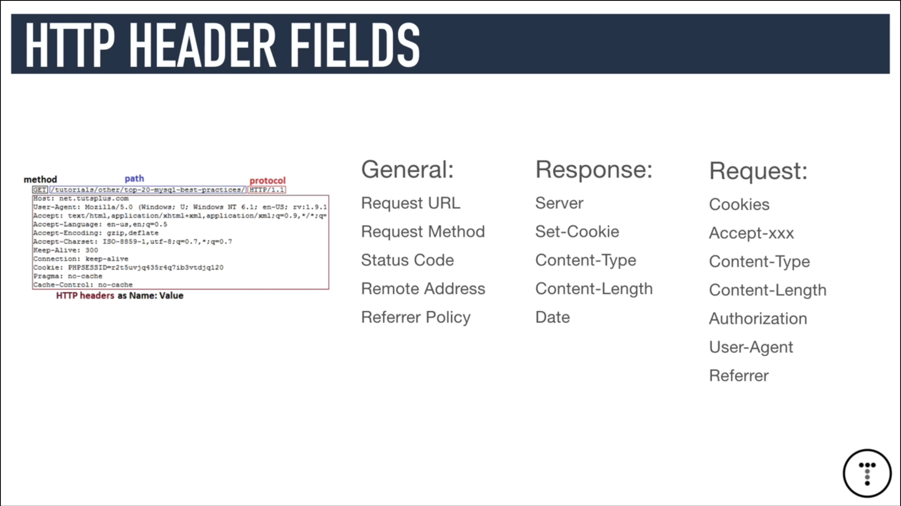

# HTTP Crash Course & Exploration

- [the video](https://www.youtube.com/watch?v=iYM2zFP3Zn0)

**http** is it stands for hypertext transfer protocol. 
- it's basically responsible for communication between web servers and clients it's the protocol of the web. 
- http is stateless meaning that every request is completely independent okay when you make one request visiting a web page or you go to another page after that or reload the page it doesn't remember anything about the previous basically transaction you can kind of look at each request as a single transaction. 

## what is https 
- https stands for hypertext transfer protocol secure 
- and it's basically where all the data that's sent back and forth is encrypted by something called ssl which stands for secure sockets layer or by tls which is the transport security layer so anytime you have users that are sending sensitive information you should always it should always be over https especially.

> GET , POST, PUT, DELETE

- with each request and response using http you have something called a header you have something called the body so the body typically with a response is going to be the html page that you're you're trying to load the the json data whatever is being sent from the server and then when you make a request you can also send a request body for instance when you submit a form the form fields you're submitting are part of the request body 
- all right now when it comes to the header you also have request headers and response headers in in something called a general header okay so it's basically divided into three parts and there's different fields on each part so typically a header will look something like this you'll make a method like a get request to a path or url with a protocol in this case http 1.1 and then you'll have all these different header fields and a lot of these you're not really going to need to care about but it's good to know what some of the more common ones do and what they are especially with the general uh part of it 
- so in general we have the request url which is pretty straightforward it's just the url you're requesting the request method so if it's a get request post request and so on the status code this is probably the most important and i'm going to go over status codes in the next slide the remote address which is the ip of the remote computer the refer policy so if you're if you go to a page from another page it might have some information on that uh and whatever the poll referrer policy is i'm not that familiar with it um 
- the response header fields you have server so if it's apache or nginx or something like that and a lot of times this will be hidden just to prevent hackers from knowing what type of server the the website uses so set cookie is used for servers to send small pieces of data called cookies from the server to the client and then content type so every response has a content type for instance if it's an html page it'll have a content type of text html css files would be text css images you have image slash png image slash jpeg if it's json data it'll be application slash json this is something that i think is really important to know with the different content types and then you also have the content length which is just that it's the length it's in octets which are i believe 8-bit bytes and then also the date okay and there's other fields as well but i'm not going to list every single one or every possible one so some common 
- request fields are cookies now if you have a cookie that was previously sent by the server and you need to send it back to the server you would do it in this field you also have a bunch of accept fields like accepting coding except character set except language these are just the different encodings and languages and stuff that um uh the client is able to understand okay content type again so if you're sending data like let's say you're sending json you'd want to set this to application slash json and then you also have content length as well so authorization um remember http is stateless so you might need to send some type of token within the header the authorization and the header so that you can for instance validate a user to access a protected route or a protected page unless you're using something like sessions on the server and then the user agent is typically a long string that has to do with the software that the user is is using so the operating system the browser things like that and then the refer has info regarding the referring site if you were to to click on a link or whatever so these are just some of the the more common header fields but there are more so if you want to check out the http spec you can look more into that all right so http status codes are really important to understand.
-----

-----

----
## http version two

- we've been dealing with 1.1 for a long long time now all the changes to version 2 are pretty much under the hood meaning you don't have to go and change the way your applications work all the status codes everything like that is all the same it's just faster and more efficient okay so it does stuff like reduces latency by enabling full request and response multiplexing so it's faster it's more efficient it's more secure and this is just a simple image to kind of of show you um uh that it can you can use multiplexing so for instance we get our html page get a response get our style sheet get our response get our script get our response so this is 1.1 with http 2 multiplexing we can get our html and then get all of our scripts and style sheets basically in one shot here and send the responses at the same time now i'm not extremely familiar with hdb2 i haven't read the spec i haven't worked with it that much but just know it is available it is out there so you might want to look more into it.

### postman
- if you don't have this client which is just awesome especially if you're building apis you can get it at getpostman.com and as you can see i can make any type of request so get post put patch delete all these.

`res.send(req.body)`
- you now is how we can send data to the server in the request body when we send a request we can attach data to that to the body and the way that we access that i'll just go ahead and send it so we can view it the way that we access that is with that request object has body so re request dot body now this won't work for for adjacent